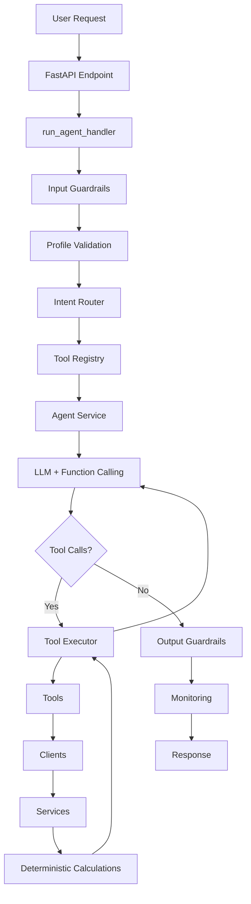

# LockIn AI

**Agentic Health & Performance Planning System**

A production-quality AI agent that helps users improve their health, nutrition, productivity, and discipline through personalized, evidence-based planning.

[](https://www.python.org/downloads/)
[](https://fastapi.tiangolo.com/)
[](https://opensource.org/licenses/MIT)

---

## 🎯 Overview

LockIn AI is NOT a general-purpose chatbot. It's a specialized health and performance planning system that:

- **Searches** nutrition databases (CIQUAL, OpenFoodFacts) for accurate food data
- **Calculates** TDEE, macros, and recipe nutrition using deterministic Python
- **Generates** personalized meal plans based on user goals and preferences
- **Tracks** daily nutrition progress and provides actionable feedback
- **Refuses** medical advice, dangerous diets, and out-of-scope requests

**Key Principle**: The LLM never calculates. All nutrition and fitness calculations are deterministic Python functions.

---

## 🏗️ Architecture



### Core Components

**Agent Layer**
- `run_agent_handler()`: Main entry point orchestrating the full pipeline
- `IntentRouter`: Classifies user requests (meal_plan, food_search, progress, etc.)
- `ToolRegistry`: Manages available tools and provides them based on intent
- `AgentService`: LLM interaction with native function calling
- `ToolExecutor`: Executes tools and collects structured observations

**Tools** (5 total)
- `food_lookup`: Search CIQUAL database for generic food nutrition
- `product_lookup`: Search OpenFoodFacts for packaged products
- `recipe_macro`: Calculate total macros for recipes
- `daily_planner`: Generate personalized meal plans
- `get_progress`: Retrieve daily nutrition progress

**Services** (Deterministic Business Logic)
- `ProfileService`: TDEE and macro calculations (Mifflin-St Jeor equation)
- `NutritionService`: Recipe and portion calculations
- `PlanningService`: Meal plan generation
- `ProgressService`: Daily tracking and progress queries

**Guardrails**
- `InputGuardrails`: Prompt injection, medical keywords, dangerous content
- `ProfileGuardrails`: Completeness validation before agent execution
- `OutputGuardrails`: Response validation, hallucination detection

**Data Layer**
- SQLite: Profiles, API cache, daily progress, meal logs
- JSONL: Request monitoring (`logs/runs.jsonl`)

---

## 🚀 Installation

### Prerequisites
- Python 3.11+
- pip

### Setup

```bash
# Clone repository
git clone https://github.com/marc-habib/lockin-ai-agent.git
cd lockin-ai-agent

# Create virtual environment
python -m venv .venv
source .venv/bin/activate  # Windows: .venv\Scripts\Activate.ps1

# Install dependencies
pip install -r requirements.txt

# Configure environment
cp .env.example .env
# Edit .env and add your LLM API key

# Preprocess CIQUAL data (creates sample CSV)
python scripts/preprocess_ciqual.py

# Initialize database
python -c "from app.database.schema import initialize_database; initialize_database()"
```

---

## 🔧 Configuration

Edit `.env`:

```bash
# LLM Provider (openai, anthropic, google)
LLM_PROVIDER=openai
LLM_MODEL=gpt-4o-mini

# API Keys
OPENAI_API_KEY=sk-...
# ANTHROPIC_API_KEY=sk-ant-...
# GOOGLE_API_KEY=AIza...

# Application
APP_ENV=development
DATABASE_PATH=data/lockin.db
```

---

## 🏃 Running Locally

```bash
# Development mode (with auto-reload)
python app/main.py

# Production mode
uvicorn app.main:app --host 0.0.0.0 --port 7860
```

Visit:
- **API**: http://localhost:7860
- **Docs**: http://localhost:7860/docs
- **Health**: http://localhost:7860/health

---

## 📡 API Documentation

### Endpoints

#### `POST /onboarding`
Create user profile (required before chat).

**Request:**
```json
{
  "user_id": "user123",
  "age": 28,
  "sex": "male",
  "height_cm": 180,
  "weight_kg": 75,
  "goal": "gain_muscle",
  "activity_level": "moderate",
  "gym_sessions_per_week": 4,
  "allergies": ["peanuts"],
  "dietary_restrictions": [],
  "disliked_foods": ["mushrooms"]
}
```

**Response:**
```json
{
  "user_id": "user123",
  "bmr": 1750.5,
  "tdee": 2713.3,
  "target_macros": {
    "calories": 3013.3,
    "protein_g": 135.0,
    "carbs_g": 339.0,
    "fat_g": 83.7
  }
}
```

#### `POST /chat`
Main agent endpoint.

**Request:**
```json
{
  "user_id": "user123",
  "message": "Plan today's meals"
}
```

**Response:**
```json
{
  "request_id": "req_abc123",
  "status": "success",
  "intent": "meal_plan",
  "response": "Here's your personalized meal plan...",
  "data": { "meals": [...] },
  "latency_ms": 1250,
  "tool_calls": ["food_lookup", "daily_planner"]
}
```

#### `GET /profile/{user_id}`
Retrieve user profile.

#### `PUT /profile/{user_id}`
Update user profile.

#### `GET /stats`
Get monitoring statistics.

---

## 🧪 Example Requests

### Onboarding
```bash
curl -X POST http://localhost:7860/onboarding \
  -H "Content-Type: application/json" \
  -d '{
    "user_id": "alice",
    "age": 25,
    "sex": "female",
    "height_cm": 165,
    "weight_kg": 60,
    "goal": "lose_fat",
    "activity_level": "light"
  }'
```

### Chat - Meal Planning
```bash
curl -X POST http://localhost:7860/chat \
  -H "Content-Type: application/json" \
  -d '{
    "user_id": "alice",
    "message": "Plan my meals for today"
  }'
```

### Chat - Progress Query
```bash
curl -X POST http://localhost:7860/chat \
  -H "Content-Type: application/json" \
  -d '{
    "user_id": "alice",
    "message": "How much protein do I have left today?"
  }'
```

### Chat - Food Search
```bash
curl -X POST http://localhost:7860/chat \
  -H "Content-Type: application/json" \
  -d '{
    "user_id": "alice",
    "message": "What are the macros for chicken breast?"
  }'
```

---

## 🐳 Deployment on HuggingFace Spaces

1. **Create a new Space** on HuggingFace
2. **Select Docker** as the SDK
3. **Push this repository** to the Space
4. **Add secrets** in Space settings:
   - `OPENAI_API_KEY` (or your chosen provider)
   - `LLM_PROVIDER=openai`
   - `LLM_MODEL=gpt-4o-mini`

The `Dockerfile` is configured for port 7860 (HuggingFace default).

---

## 🛡️ Safety & Guardrails

### Input Validation
- Prompt injection detection
- Medical keyword filtering
- Dangerous content blocking
- Message length limits

### Profile Validation
- Completeness checks before agent execution
- Returns missing fields if profile incomplete

### Output Validation
- Hallucination detection (numbers without tool grounding)
- Medical advice filtering
- Dangerous recommendation blocking

### Scope Enforcement
- Refuses medical diagnosis
- Refuses dangerous diets (extreme deficits, starvation)
- Refuses steroid/drug advice
- Stays within health/nutrition/fitness domain

---

## 📊 Monitoring

All requests are logged to `logs/runs.jsonl`:

```json
{
  "request_id": "req_abc123",
  "user_id": "alice",
  "timestamp": "2026-07-02T19:00:00",
  "endpoint": "/chat",
  "intent": "meal_plan",
  "tool_calls": ["food_lookup", "daily_planner"],
  "latency_ms": 1250,
  "status": "success"
}
```

Access statistics via `GET /stats`.

---

## 🧬 Tech Stack

- **Framework**: FastAPI 0.115.0
- **LLM Clients**: OpenAI, Anthropic, Google Gemini
- **Database**: SQLite (profiles, cache, progress)
- **Data Sources**: CIQUAL (nutrition), OpenFoodFacts (products)
- **Monitoring**: JSONL logging
- **Deployment**: Docker, HuggingFace Spaces

---

## 📁 Project Structure

```
lockin-ai/
├── app/
│   ├── agent/          # Intent router, tool registry, agent service, handler
│   ├── api/            # FastAPI routes
│   ├── clients/        # CIQUAL, OpenFoodFacts, LLM clients
│   ├── database/       # SQLite connection and schema
│   ├── guardrails/     # Input, profile, output validation
│   ├── models/         # Enums (Intent, Goal, ActivityLevel, etc.)
│   ├── monitoring/     # JSONL request logging
│   ├── prompts/        # System prompts, tool descriptions
│   ├── repositories/   # Profile, cache, progress DB operations
│   ├── schemas/        # Pydantic models
│   ├── services/       # Business logic (profile, nutrition, planning, progress)
│   ├── tools/          # 5 tools (food lookup, product, recipe, planner, progress)
│   ├── utils/          # Calculations (TDEE, macros), constants
│   ├── config.py       # Configuration management
│   └── main.py         # FastAPI application
├── data/               # CIQUAL CSV, SQLite database
├── logs/               # Request logs (JSONL)
├── scripts/            # CIQUAL preprocessing
├── tests/              # Unit and integration tests
├── Dockerfile          # HuggingFace Spaces deployment
├── requirements.txt    # Python dependencies
└── README.md           # This file
```

---

## ⚠️ Limitations

- **No medical advice**: Cannot diagnose or treat medical conditions
- **Simplified meal planning**: Uses template-based approach (could be enhanced)
- **Limited food database**: Sample CIQUAL data (15 foods) - full database recommended
- **No workout generation**: Placeholder for future implementation
- **Single-user sessions**: No authentication/authorization (add for production)

---

## 🚧 Future Improvements

- [ ] Enhanced meal planning with ML-based food selection
- [ ] Workout plan generation
- [ ] Shopping list optimization
- [ ] Multi-day meal prep planning
- [ ] Integration with fitness trackers (WHOOP, Garmin)
- [ ] User authentication and multi-tenancy
- [ ] Advanced caching strategies
- [ ] A/B testing for meal plan quality

---

## 📄 License

MIT License - see LICENSE file for details.

---

## 🙏 Acknowledgments

- **CIQUAL**: French food composition database
- **OpenFoodFacts**: Open food products database
- **FastAPI**: Modern web framework
- **Pydantic**: Data validation

---

## 📧 Contact

For questions or issues, please open an issue on GitHub.